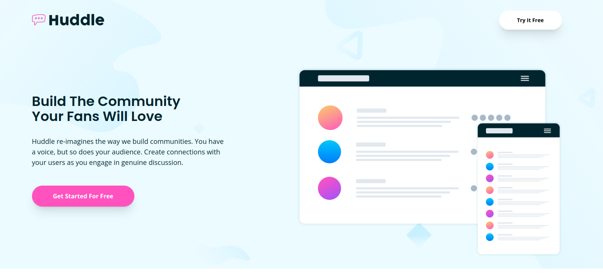

# Frontend Mentor - Huddle landing page with alternating feature blocks solution

This is a solution to the [Huddle landing page with alternating feature blocks challenge on Frontend Mentor](https://www.frontendmentor.io/challenges/huddle-landing-page-with-alternating-feature-blocks-5ca5f5981e82137ec91a5100).

## Table of contents

- [Overview](#overview)
  - [Screenshot](#screenshot)
  - [Links](#links)
- [My process](#my-process)
  - [Built with](#built-with)
- [Author](#author)

## Overview

### Screenshots

### Links

- Solution URL: [Frontend Mentor IO Solution]([https://www.frontendmentor.io/solutions/stats-preview-card-component-4thGx7DsIJ](https://www.frontendmentor.io/solutions/huddle-landing-page-using-tailwind-css-O2xN95zqze))
- Live Site URL: [Hosted on GitHub Pages]([https://filipjanik00.github.io/stats-preview-card-component-main/](https://filipjanik00.github.io/huddle-landing-page-alternating-feature-blocks/))

## My process

### Built with

- Semantic HTML5 markup
- Flexbox
- Mobile First Workflow
- Tailwind CSS

## Author

- Frontend Mentor - [@filipjanik00](https://www.frontendmentor.io/profile/filipjanik00)
